# Sales Forecasting and Trend Analysis

This project, "Sales Forecasting and Trend Analysis," is designed to provide comprehensive insights into sales data from a superstore by leveraging time series analysis and forecasting techniques. The primary objectives are to visualize historical sales trends, identify key revenue drivers across states and product categories, and build accurate models to predict future sales.

By utilizing advanced statistical models such as SARIMA, ARIMA, Prophet, and Exponential Smoothing, the project evaluates both the accuracy and applicability of each method for business forecasting. The findings enable businesses to make informed decisions regarding inventory management, marketing strategies, and resource allocation by anticipating demand fluctuations and regional sales patterns.

The project delivers actionable recommendations based on model performance and provides clear visualizations to support data-driven decision-making for stakeholders.

## Key Findings
- **Sales Trends:**
  - Sales generally show a positive trend over the years, with noticeable seasonality in certain months.
  - The highest sales are typically observed in the last quarter of each year, indicating strong end-of-year demand.
   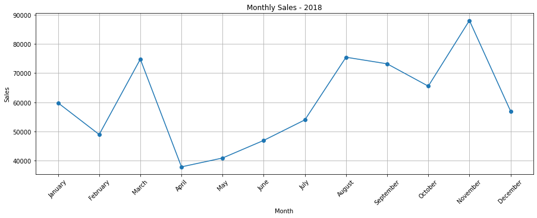

   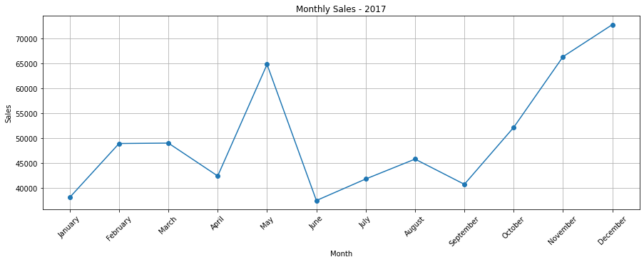

   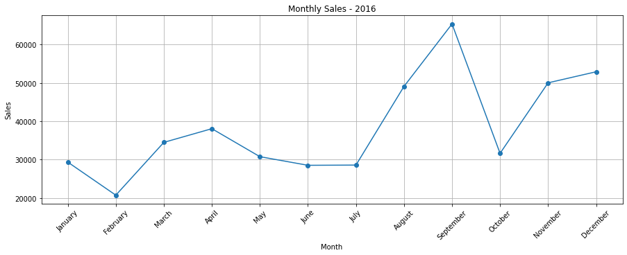

   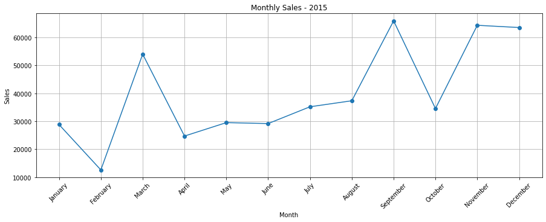
   
- **Top States:**
  - The top 10 states contribute a significant portion of total sales, with California consistently outperforming others across the different categories of products.
  - State-level analysis reveals regional strengths and opportunities for targeted marketing.

  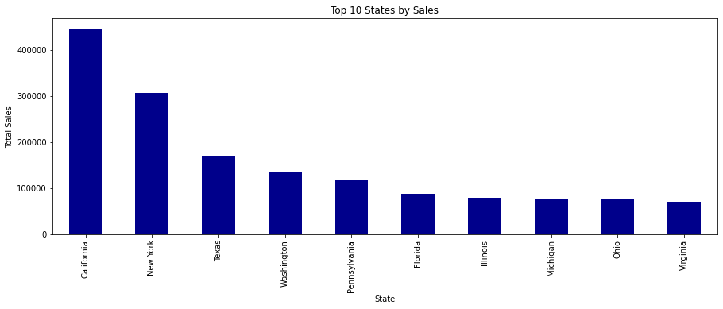

  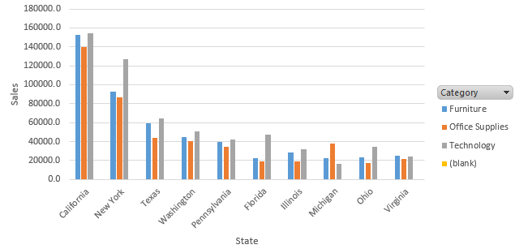
    
- **Category Insights:**
  - Technology, Furniture, and Office Supplies each have distinct sales patterns across states.
  - Technology often leads in total sales, but some states show higher demand for Furniture or Office Supplies.
 
    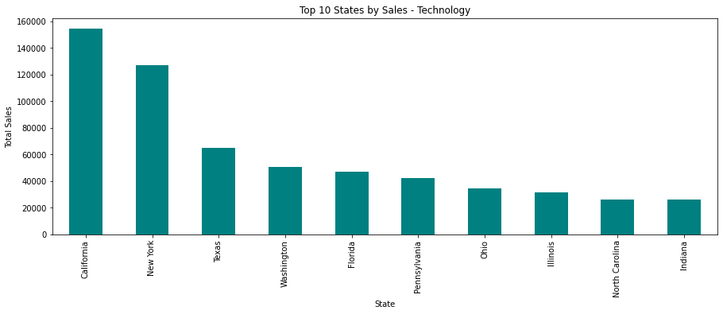

    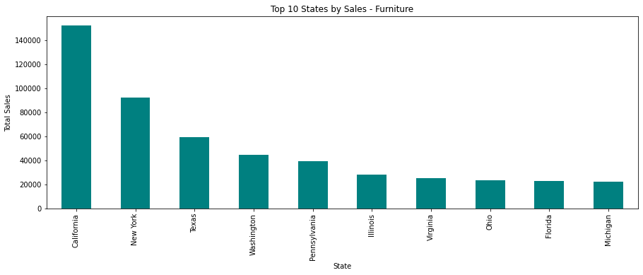

    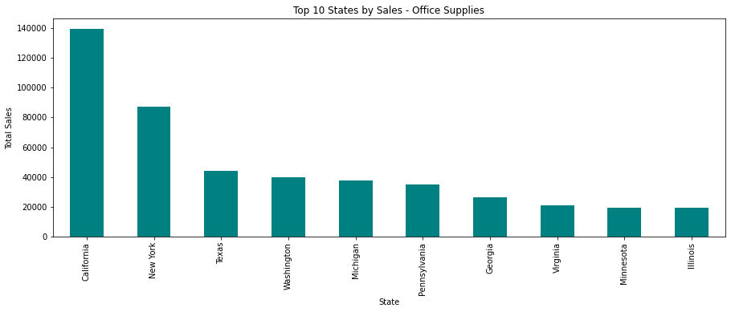

    
- **Forecasting Performance:**
  - All four models (SARIMA, ARIMA, Prophet, Exponential Smoothing) provide reasonable forecasts, with SARIMA and Prophet generally achieving the lowest error metrics (MAE, RMSE, MAPE).
  - The models successfully capture both trend and seasonality, with forecasts indicating continued growth in the coming months.
 
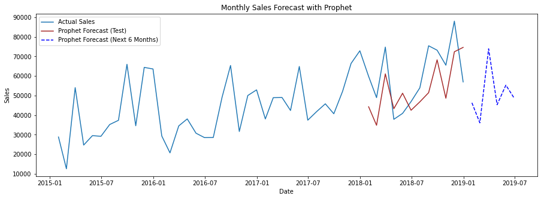

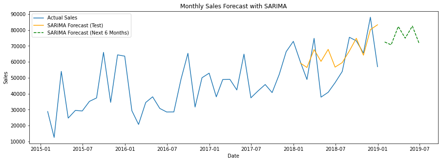

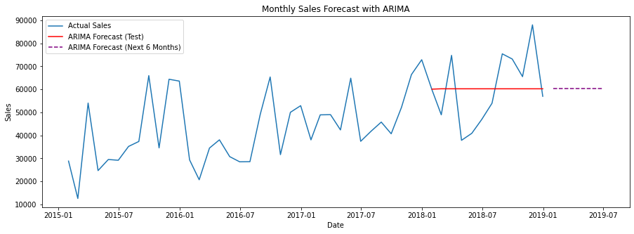

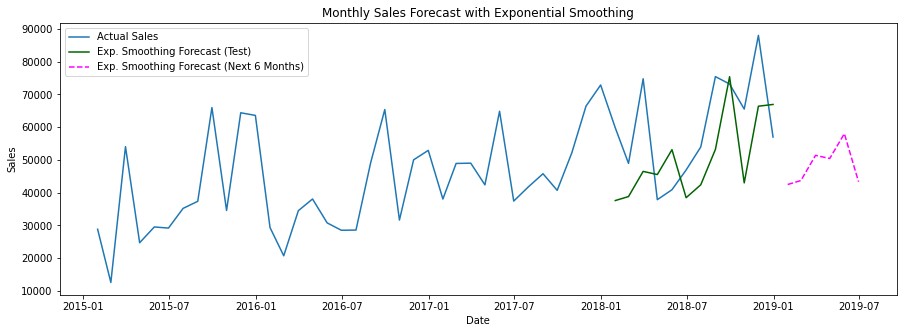

## Model Performance Summary

| Metric      | SARIMA      | ARIMA       | Prophet     | Exp. Smoothing |
|-------------|-------------|-------------|-------------|----------------|
| **MAE**     | 10,454.65   | 12,654.76   | 12,470.60   | 14,919.38      |
| **RMSE**    | 13,817.40   | 14,825.86   | 13,759.65   | 16,782.07      |
| **MAPE**    | 21.06%      | 22.72%      | 20.69%      | 24.52%         |

## Key Insights

- **Prophet** achieved the lowest MAPE (20.69%), indicating the most accurate relative forecasts.
- **SARIMA** produced the lowest absolute errors (MAE and RMSE), making it a strong candidate as well.
- **Exponential Smoothing** had the highest errors across all metrics, suggesting it is less suitable for this dataset.
- **ARIMA** performed better than Exponential Smoothing but was outperformed by Prophet and SARIMA.

## Recommendation

- **Prophet** is recommended for business forecasting due to its superior relative accuracy (MAPE).
- **SARIMA** is also a viable model, especially where lower absolute error is required.
  
- **Business Implications:**
  - The analysis supports data-driven decision-making for inventory planning, sales strategy, and resource allocation.
  - Forecasts can be used to anticipate demand spikes and optimize supply chain operations.

## Requirements
- Python 3.7+
- pandas, numpy, matplotlib, seaborn
- statsmodels, scikit-learn, prophet, joblib

## Usage
1. Open `model.ipynb` in Jupyter or VS Code.
2. Run all cells sequentially:
   - Data loading and preprocessing
   - EDA and visualization
   - Time series modeling and evaluation
   - Model saving
3. Download the generated model files if needed:
   - `sarima_model.pkl`
   - `arima_model.pkl`
   - `prophet_model.pkl`
   - `exp_smoothing_model.pkl`

